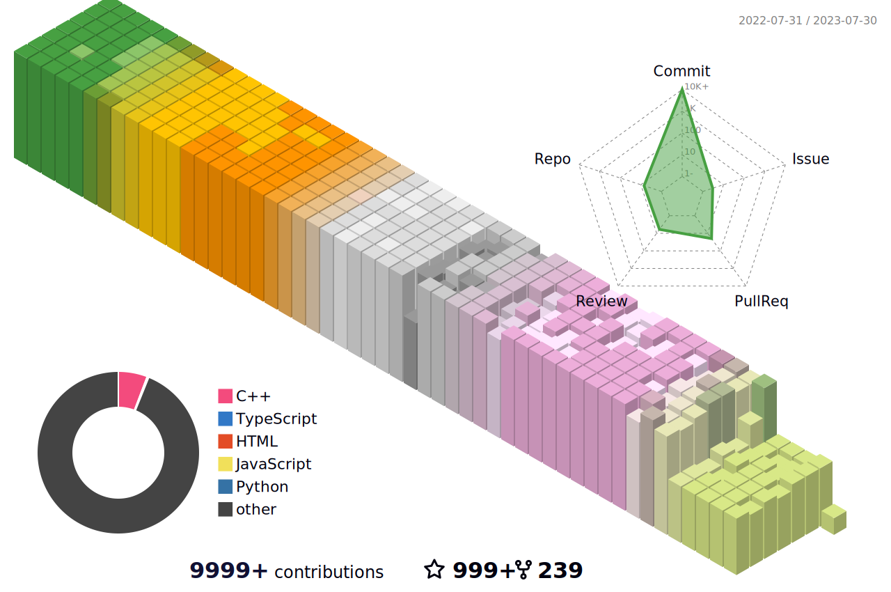

<h1 align="center">Hi 👋, I'm Rafail</h1>
<h2 align="center">Android and Games developer from Russia</h2>

- 🔭 I’m currently working on [Tabiin_Muslim_Planner](https://github.com/Raf0707/Tabiin_Muslim_Planer)

- 🌱 I’m currently learning **Java, Kotlin, C++**

- 👯 I collaborate with [FF-Settings-Admin](https://github.com/Raf0707/FF-Settings-Admin)

- 🤝 I’m looking for help with [Karint](https://github.com/Raf0707/Karint)

- 👨‍💻 All of my projects are available at [https://github.com/Raf0707](https://github.com/Raf0707)

- 📝 I regularly write articles on [https://t.me/Tabiin_RTX_News](https://t.me/Tabiin_RTX_News)

- 📫 How to reach me **raf_android-dev@mail.ru**

<h3 align="left">Languages and Tools:</h3>

          <a href="https://www.linux.org/" target="_blank" rel="noreferrer">   <a href="https://www.python.org" target="_blank" rel="noreferrer">     

&nbsp;

![github-graph0(https://github-profile-trophy.vercel.app/?username=Raf0707&theme=flat)

<h2 align="left">Connect with me:</h2>

  <a href="https://dev.to/raf0707">
    <code></code>
  </a>   
  
  <a href="https://www.hackerrank.com/raf0707/" target="_blank">
    <code></code>
  </a>

  <a href="https://www.hackerearth.com/@raf0707" target="_blank">
    <code></code>
  </a>

  <a href="https://www.codechef.com/users/raf0707" target="_blank">
    <code></code>
  </a>
  
  <a href="https://leetcode.com/raf0707/" target="_blank">
    <code></code>
  </a>

<h3 align="left">Support:</h3>

  

